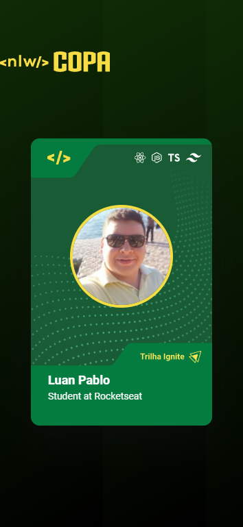
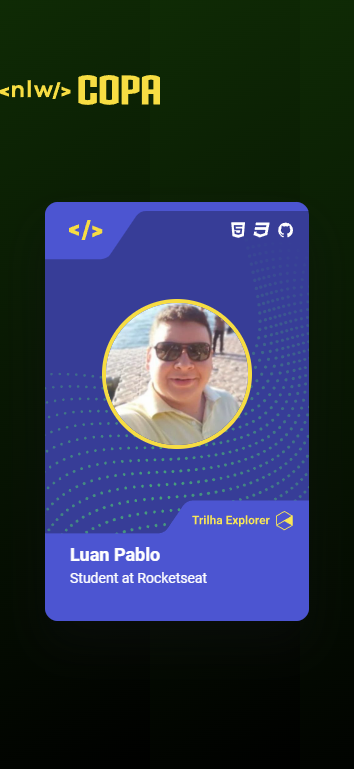

# NLW Copa Card

>Projeto 'NLW Copa Card' by Rocketseat

Projeto <I><b>'NLW Copa Card'</b> da Rocketseat.
Um projeto do professor Mayk Brito, ensinando a fazer os Cards para o NLW Copa / Trilha Explorer, com conceitos do HTML, CSS e uma pincelada de Javascript.

[🔗 Clique aqui para acessar](https://nlw-copa-card-two.vercel.app/)

## 🌐 Tecnologias

  
 
 

## 📱 Contato

